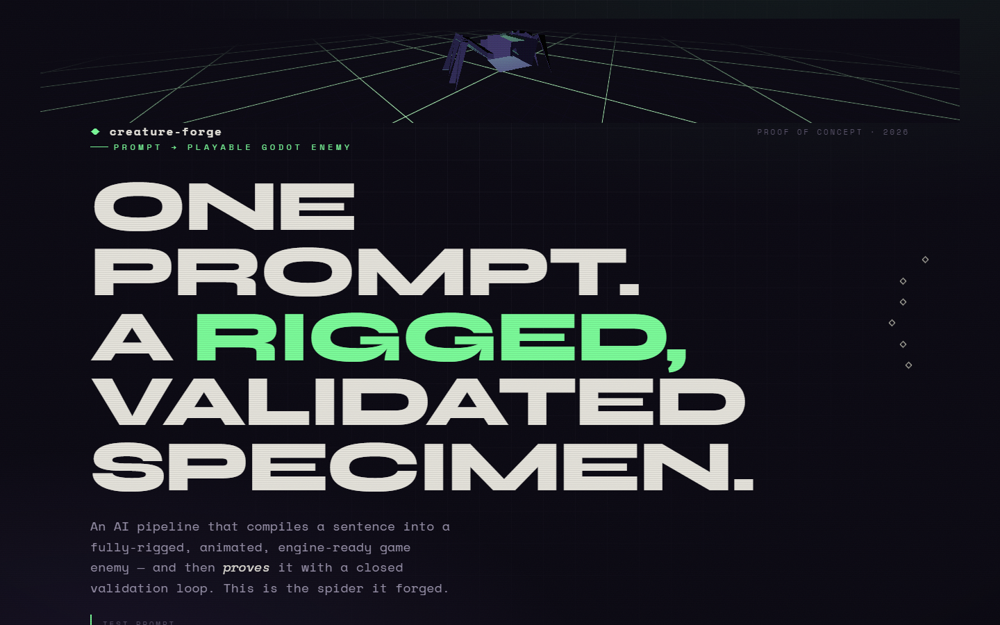
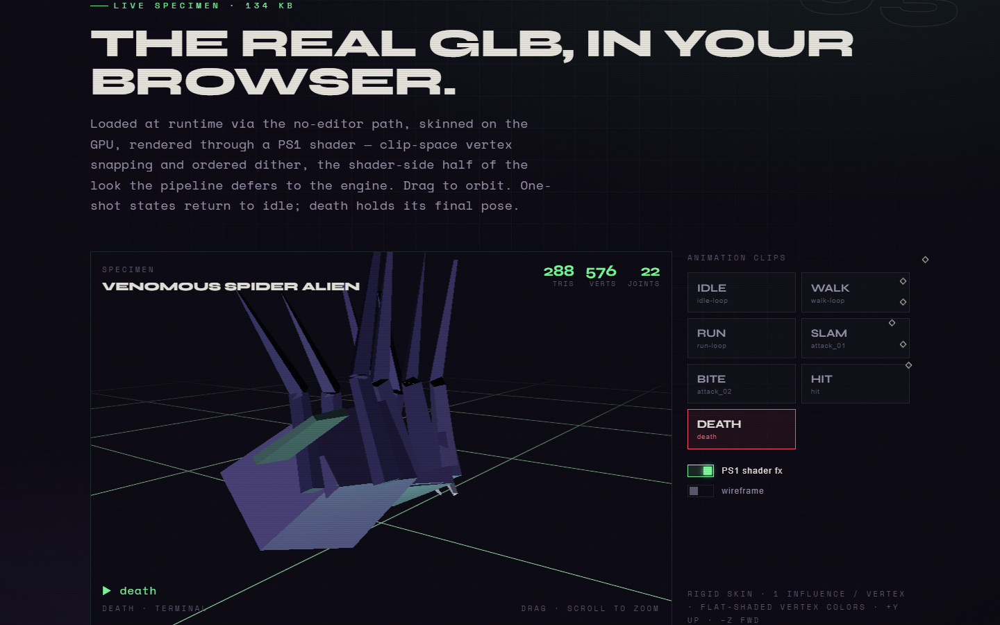

# creature-forge

**An AI pipeline that compiles a sentence into a rigged, animated, validated,
Godot-ready game enemy — and an interactive web showcase that proves it.**

> Test prompt: *"small venomous spider alien, low-poly PS1 horror style, fast
> skittering movement, multiple attacks, death animation."*

The pipeline turns that prompt into `spider_alien.glb`: 288 triangles, 22 joints,
7 animation clips, passing the official Khronos glTF validator at **0/0/0/0** and a
ten-check semantic gate at **10/10**. The showcase loads that exact GLB in your
browser, renders it through a custom PS1 shader, and walks through the eight-stage
architecture and the closed validation loop that makes the result trustworthy.




---

## The showcase site (`web/`)

A single-page scrollytelling site — **Vite + React + TypeScript**,
**react-three-fiber**, and a hand-written PS1 `shaderMaterial` (clip-space vertex
snapping + Bayer-ordered dither + color-depth reduction). Every statistic on the
page is imported from the real pipeline artifacts (`*.json`) — no hand-typed
numbers, honoring the pipeline's own *"the JSON is the single source of truth"*
principle.

```bash
cd web
npm install
npm run dev        # http://localhost:5173
npm run build      # type-checked static bundle in web/dist
```

Pushing to `main` builds and deploys the site to GitHub Pages via
`.github/workflows/deploy.yml`.

### Aesthetic

"Specimen under examination" — a dark forensic-lab × PS1-horror direction:
void-purple ground, a single toxic-green accent pulled from the spider's eyes,
Syne + Space Mono, scanlines/grain/vignette atmosphere, and a live containment
viewport with a wireframe HUD.

## The pipeline (`pipeline/`, `godot/`)

The proof-of-concept itself. See [`pipeline/README.md`](pipeline/README.md) for the
full write-up and [`IMPROVED_PIPELINE.md`](IMPROVED_PIPELINE.md) for the corrected
eight-stage architecture and the honest critique of the original design.

```
pipeline/
  generate_creature.py        # hand-written glTF 2.0 writer — builds the GLB + sidecars
  validate_asset.py           # the Stage-8 gate: CPU FK + LBS, 10 checks, speed write-back
  run_khronos_validator.mjs   # official Khronos conformance
  assets/                     # spider_alien.glb + asset_spec / godot_setup sidecars
  reports/                    # validation_report.json + khronos_report.json
godot/                        # Godot 4 integration: factory, controller, post-import, demo
docs/superpowers/specs/       # the design spec this site was built from
```

### What's real, what's stubbed

Stages 1, 5, 6, 7 and 8 are implemented for real. Stage 3 (ML image-to-3D mesh
generation) runs in its deterministic procedural fallback tier — it produces
exactly the artifact a real mesh-gen stage would, with the same conventions,
budgets, and downstream contract, so the rig/animate/package/validate/integrate
layers it feeds are the real thing. The Godot scripts are carefully written but
unverified in-engine.

## Credits

Pipeline and assets: the creature-forge proof of concept. Showcase site built with
the [frontend-design](https://github.com/anthropics/claude-code) taste skill and
the superpowers brainstorm → spec → plan → build workflow.
